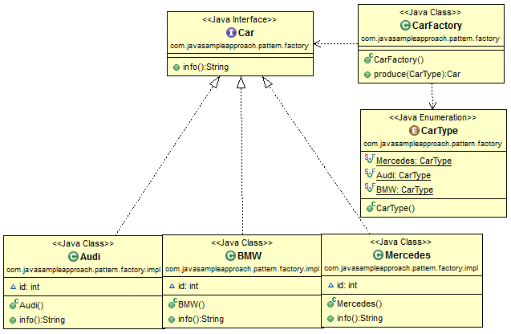

工厂是生产东西的，所以是一种创造东西的车间，工厂提供了一种复杂的车间，将各种复杂的部件隐藏起来合成一个东西，对外只暴露一个整体的东西（对象），
内容的组装确不知道

本示例，我们使用经典的工厂用例，车工厂，类的说明如下：
- 1.创建一个汽车接口Car,接口一个描述信息的方法info(),返回String
- 2.创建三个汽车类BMW,VOLOV,TOYOTA实现接口Car
- 3.创建一个枚举类CarType来记录各种车的类型
- 4.创建工厂类CarFactory，根据传入的汽车类型来生产车

以下是使用网上的一个图来说明这个工厂模式

参考网址：[参考](https://grokonez.com/design-pattern/java-design-pattern-factory-pattern)
