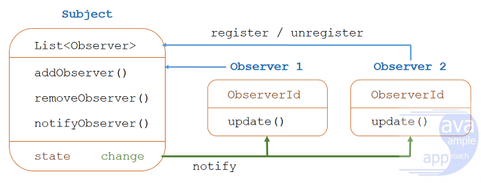
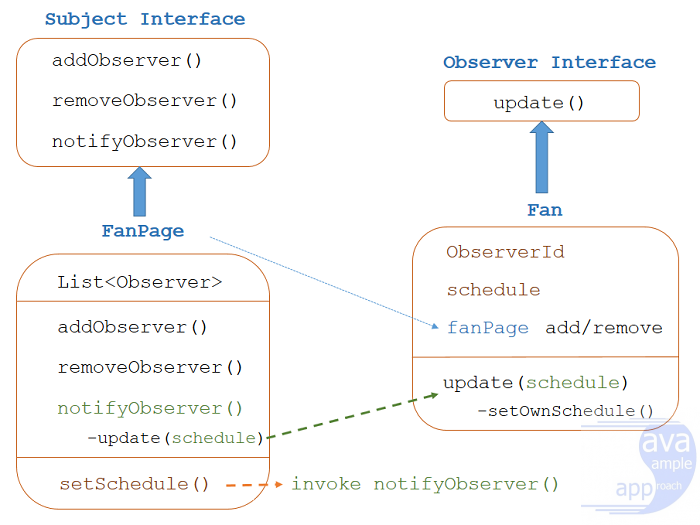

## 观察者模式定义
观察者模式定义了主体和观察者之间的一对多关系：
- 主体维护一个观察者列表，并具有添加，删除和通知其观察者的方法。
- 当主体改变其状态，所有观察员的通知和更新自动。
- 主题只知道观察者列表，并不关心它们如何实现。

## 项目概述
要为观察者模式（Observer Pattern）构建一个示例，我们将创建一些接口及其实现。
如下图：

我们的目标是创建一个开发经理专页（PmPage），每当PmPage创建其日程安排时，将自动通知关注它的组员（）。
之后，组员们将根据PmPage时间表更新自己的时间表。组员还可以取消订阅PmPage。

此示例参考：
[参考](https://grokonez.com/design-pattern/observer-pattern-java)